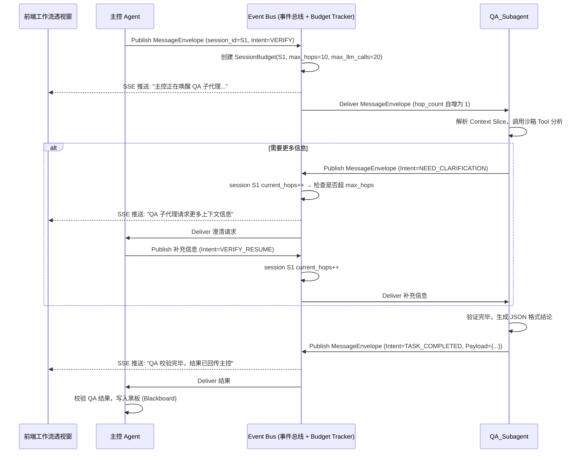

# 01 Agent 通信协议深入设计 (Message Envelope RFC)

## 1. 概述与设计原则
在 PM-Agent 2.0 中，多智能体（Multi-Agent）系统必须从”无结构自然语言漫游”升级为”严格契约驱动”。本文件详细定义了用于 Agent 间通信的 **消息信封协议 (Message Envelope Protocol)**。

**核心设计原则**：
1. **去中心化执行，中心化路由**：基于 Hub-and-Spoke 模式，所有消息必须通过 Main Agent (或 Event Bus) 路由。
2. **防死锁 (Deadlock-Free)**：在协议底层内置双层熔断（链路级 hop_count + 会话级 session_budget），杜绝 LLM 间的死循环与费用失控。
3. **前端可观测**：协议结构必须完全兼容 SSE (Server-Sent Events) 的序列化需求，以便前端渲染。
4. **可序列化保证**：所有信封字段必须为 JSON 可序列化类型，为未来微服务演进预留确定性基础。

## 2. 信封数据结构定义 (Pydantic Schema)

在核心业务逻辑 `app/core/events.py` 或 `messages.py` 中，消息信封应被严格定义：

```python
from pydantic import BaseModel, Field
from typing import Optional, Dict, Any, Literal
from datetime import datetime

class MessageEnvelope(BaseModel):
    # 基础路由信息
    msg_id: str = Field(..., description=”全局唯一消息 ID”)
    parent_msg_id: Optional[str] = Field(None, description=”追踪对话线程的父 ID”)
    session_id: str = Field(..., description=”子任务会话 ID，用于在 Bus 侧追踪整个交互链路”)
    sender_id: str = Field(..., description=”发送方标识 (如 Main_Agent, QA_Subagent)”)
    recipient_id: str = Field(..., description=”接收方标识 (只能是主控或特定子代理)”)
    
    # 意图与上下文
    intent: str = Field(..., description=”核心操作意图指令 (e.g., 'VERIFY_EDGE_CASES')”)
    context_slice: Dict[str, Any] = Field(
        default_factory=dict, 
        description=”主控为接收方切分的局部上下文，严禁全量透传”
    )
    task_objective: str = Field(..., description=”具体的自然语言任务描述”)
    
    # 生命周期控制（信封级，只读标记）
    hop_count: int = Field(default=0, description=”当前信封经过的路由跳数，由 Bus 自增，发送方不可修改”)
    priority: Literal[“LOW”, “NORMAL”, “HIGH”, “CRITICAL”] = Field(default=”NORMAL”)
    
    # 契约与格式
    expected_output_format: str = Field(default=”JSON_SCHEMA_V1”)
    
    # 时序追踪
    created_at: datetime = Field(default_factory=datetime.utcnow)

class SessionBudget(BaseModel):
    “””由 Event Bus 维护的会话级预算，不暴露给 Agent，不可被发送方篡改。”””
    session_id: str
    max_hops: int = Field(default=10, description=”单条链路最大往返次数（防 ping-pong）”)
    max_llm_calls: int = Field(default=20, description=”整个子任务允许的 LLM 调用总次数（防费用失控）”)
    current_hops: int = Field(default=0)
    current_llm_calls: int = Field(default=0)
```

### 2.1 可序列化约束

信封必须始终满足 JSON 可序列化要求。CI 中应包含如下校验测试：

```python
def test_envelope_serializable():
    envelope = MessageEnvelope(...)
    json.dumps(envelope.model_dump(), default=str)  # 不应抛出异常
```

## 3. 通信时序与总线交互 (Sequence Diagram)

下面是主控 Agent 请求 QA Subagent 验证逻辑的完整生命周期：



## 4. 异常处理与双层熔断机制

### 4.1 链路级熔断 (Hop Limit Exhaustion)

当 Subagent 因理解偏差或幻觉，不断向主控发起无意义的追问（Ping-Pong）时：

- **Bus 统一维护计数**：每条消息经过 Bus 路由时，Bus 对该 `session_id` 的 `current_hops` 自增。发送方无法修改此计数。
- 若 `current_hops >= max_hops`，Bus 拦截该消息并向主控发送 `HopLimitExceededEvent`。
- 主控接收异常后，标记该子任务节点为失败，并视情况直接抛出给用户进行 `Arbitration`。

### 4.2 会话级预算熔断 (Session Budget Exhaustion)

防止某个子任务因反复重试消耗过多 LLM 调用（费用失控）：

- Bus 追踪每个 session 触发的 LLM 调用次数（由 Agent 回报或 Bus 监听 tool 调用事件）。
- 若 `current_llm_calls >= max_llm_calls`，Bus 向主控发送 `BudgetExhaustedEvent`，强制终止该子任务。
- 主控可选择降级处理（用现有部分结果组装）或上报用户。

### 4.3 幻觉与格式异常 (Malformed Payload)

若 Subagent 回传的数据不符合 `expected_output_format`：
- 主控层自带 **Schema Validator**。
- 若校验失败，由主控自动发起一次重试指令（带 Error Log），不占用用户交互轮次（但消耗 hop_count 和 llm_calls 预算）。
- 最多自动重试 2 次，超过则标记为需人工介入。

### 4.4 为什么 TTL 不放在信封上

旧设计将 TTL 作为信封的 mutable field，存在两个致命问题：
1. 任何发送方可以在 fork 信封时重置 TTL，熔断机制形同虚设。
2. 默认值 3 过小，正常的"澄清→补充→重试"链路就会撞墙。

新设计将熔断逻辑完全内聚在 Bus 侧的 `SessionBudget` 中，Agent 无法感知也无法篡改，同时默认配额 (max_hops=10) 给正常交互留出了充裕空间。

## 5. 对已有代码的重构影响
- 废弃 `app/core/events.py` 中散落的 `StepResult`，全部统一为以 `MessageEnvelope` 为载体的状态流转机制。
- 将 `WorkflowEngine` 改造成一个**消息驱动的反应式循环 (Message-driven Reactive Loop)**，只要总线中有针对主控的消息，主控就被唤醒处理。
- Event Bus 需新增 `SessionBudgetTracker` 组件，负责创建、递增、校验和销毁会话预算。
