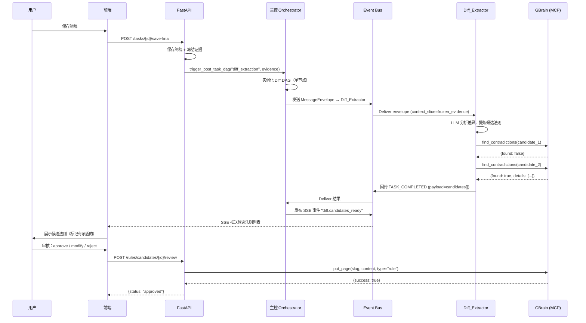

# 07 Diff 提炼流程技术设计 (Lesson Extraction Pipeline)

## 1. 在 v2 体系中的定位

Diff 流程不是任务执行的一部分，而是**任务结束后的经验沉淀链路**。

```text
用户发起任务
  → 主控编排 DAG → Subagent 并行执行 → 方案收敛 → 产物输出
  → 用户在前端编辑终稿并保存
  → 【Diff 流程开始】证据冻结 → 差异分析 → 候选法则提炼 → 前端审核 → GBrain 入库
```

在 v2 架构中，Diff 流程是一个**独立的后置 DAG**，在主任务 DAG 完成后由系统自动触发，与主任务的 Agent 编排完全解耦。

---

## 2. Diff 流程作为独立 DAG

### 2.1 为什么不是"主 DAG 的一个节点"

主 DAG 的目的是"为用户产出方案"。Diff 流程的目的是"从用户的修改中学习"。这两件事的触发时机、数据依赖、用户交互模式完全不同：

| 维度 | 主任务 DAG | Diff DAG |
|---|---|---|
| 触发时机 | 用户发起任务时 | 用户保存终稿后 |
| 输入 | 用户目标 + 材料 | AI 草稿 + 用户终稿 + 差异 |
| 用户参与 | 可能 Takeover、仲裁 | 只做审核（通过/修改/驳回） |
| 产出 | 方案文档 | 候选法则 |
| 失败影响 | 用户拿不到方案 | 不影响本次方案，只是没学到经验 |

把 Diff 流程混进主 DAG 会导致：主任务的 Blackboard 被 Diff 的中间状态污染，Takeover 机制要额外处理"用户不想管 Diff"的情况，复杂度不成正比。

### 2.2 Diff DAG 的模板定义

```yaml
# task_templates/diff_extraction.yaml
template_name: "经验提炼"
trigger: "POST_TASK_SAVE"  # 主任务终稿保存后自动触发
auto_approve: true          # 模板任务无需用户确认 DAG 结构
required_slots: ["Diff_Extractor"]
dag_edges:
  - from: "START"
    to: "Diff_Extractor"
  - from: "Diff_Extractor"
    to: "END"
```

这是一个只有一个节点的极简 DAG。未来如果需要"多步 Diff"（如先分类、再提炼、再去重），可以扩展为多节点，但骨架不变。

---

## 3. Diff_Extractor — 作为 Subagent 的技术实现

### 3.1 Slot 注册

Diff_Extractor 是一个 **APPEND 类型**的 Slot，属于 Core Pack（基础包），不依赖任何扩展包：

```python
# app/agents/core_pack/diff_extractor.py
from app.agents.base import BaseSubagent

class DiffExtractor(BaseSubagent):
    slot_name = "Diff_Extractor"
    action_type = "APPEND"          # 追加槽位，不覆盖任何基础 Slot
    contract_version = "1.0"
    
    async def execute(self, envelope: MessageEnvelope) -> MessageEnvelope:
        # 1. 从 context_slice 获取证据包
        evidence = envelope.context_slice["frozen_evidence"]
        
        # 2. 调用 LLM 分析差异，提炼候选法则
        candidates = await self._extract_candidates(evidence)
        
        # 3. 对每条候选法则，调用 GBrain find_contradictions 检测矛盾
        for candidate in candidates:
            conflicts = await self.call_tool("knowledge.find_contradictions", {
                "content": candidate.content
            })
            candidate.has_conflicts = conflicts["found"]
            candidate.conflict_details = conflicts.get("details", [])
        
        # 4. 返回候选法则列表
        return self._build_response(envelope, candidates)
```

### 3.2 SlotContract

```python
DIFF_EXTRACTOR_CONTRACT = SlotContract(
    slot_name="Diff_Extractor",
    version="1.0",
    required_context_keys=["frozen_evidence"],
    optional_context_keys=["task_metadata", "knowledge_context"],
    output_schema="CandidateRules_v1"
)
```

### 3.3 ToolPolicy

Diff_Extractor 的工具权限：

```python
# Diff_Extractor 可用的 Tool
allowed_tools = [
    "knowledge.find_contradictions",  # 检测与已有法则的矛盾
    "knowledge.search",               # 检索相关已有法则（避免重复）
]

# 明确禁止
denied_tools = [
    "knowledge.put_page",  # Diff Agent 不能直接写入 GBrain！
    "artifact.write",      # 不能修改用户终稿
]
```

---

## 4. 证据冻结：数据结构与触发机制

### 4.1 触发时机

用户在前端点击"保存终稿"后，后端 API 执行：

```python
# app/api/server.py 中的终稿保存接口
@app.post("/tasks/{task_id}/save-final")
async def save_final_draft(task_id: str, body: FinalDraftBody):
    # 1. 保存终稿
    await artifact_service.save(task_id, body.content)
    
    # 2. 冻结证据
    evidence = await evidence_service.freeze(task_id)
    
    # 3. 自动触发 Diff DAG
    await orchestrator.trigger_post_task_dag(
        template="diff_extraction",
        context={"frozen_evidence": evidence.to_dict(), "task_metadata": {...}}
    )
    
    return {"status": "saved", "diff_triggered": True}
```

### 4.2 FrozenEvidence 数据结构

```python
from pydantic import BaseModel, Field
from typing import List, Dict, Optional
from datetime import datetime

class DiffHunk(BaseModel):
    """一个具体的差异片段。"""
    location: str = Field(..., description="差异在文档中的位置标识")
    ai_content: str = Field(..., description="AI 草稿中的原始内容")
    user_content: str = Field(..., description="用户终稿中的修改内容")
    change_type: str = Field(..., description="addition | deletion | modification")

class FrozenEvidence(BaseModel):
    """证据冻结包 — 不可变，一旦创建不再修改。"""
    task_id: str
    frozen_at: datetime
    
    # 核心证据
    ai_draft_snapshot: str = Field(..., description="AI 输出的完整草稿（冻结副本）")
    user_final_snapshot: str = Field(..., description="用户保存的完整终稿（冻结副本）")
    diff_hunks: List[DiffHunk] = Field(default_factory=list, description="结构化的差异列表")
    
    # 上下文证据
    arbitration_records: List[Dict] = Field(
        default_factory=list, 
        description="用户在主任务期间的仲裁记录"
    )
    reviewer_records: List[Dict] = Field(
        default_factory=list,
        description="Reviewer 门禁的驳回/修改建议"
    )
    
    # 元数据
    task_type: str = Field(..., description="任务类型（如 cloud_native_promotion）")
    active_expansion_pack: Optional[str] = Field(None, description="当时加载的扩展包")
```

### 4.3 Diff 算法

结构化差异不是简单的 `unified diff`。需要**语义级 diff**：

```python
async def compute_diff_hunks(ai_draft: str, user_final: str) -> List[DiffHunk]:
    """
    计算 AI 草稿与用户终稿之间的语义差异。
    
    策略：
    1. 按段落/章节切分两份文档
    2. 用文本相似度对齐段落（处理用户重排序的情况）
    3. 对每对对齐段落，用 LLM 判断是否有实质性修改（而非纯润色）
    4. 只保留实质性修改作为 DiffHunk
    """
    # 第一步：结构化切分
    ai_sections = split_into_sections(ai_draft)
    user_sections = split_into_sections(user_final)
    
    # 第二步：对齐（处理增删和重排）
    alignments = align_sections(ai_sections, user_sections)
    
    # 第三步：逐对比较，过滤纯润色
    hunks = []
    for ai_sec, user_sec, change_type in alignments:
        if change_type == "identical":
            continue
        if await is_substantive_change(ai_sec, user_sec):
            hunks.append(DiffHunk(
                location=ai_sec.heading or user_sec.heading,
                ai_content=ai_sec.text if ai_sec else "",
                user_content=user_sec.text if user_sec else "",
                change_type=change_type
            ))
    
    return hunks
```

**关键判断：什么算"实质性修改"？**

- 用户补充了 AI 遗漏的业务前置条件 → 实质性 ✅
- 用户删除了 AI 瞎编的平台事实 → 实质性 ✅
- 用户补齐了异常流处理 → 实质性 ✅
- 用户把"进行"改成"开展" → 纯润色 ❌
- 用户调整了段落顺序但内容不变 → 纯润色 ❌

这个判断由一次 LLM 调用完成（`is_substantive_change`），输入是两段文本，输出是 boolean + 理由。

---

## 5. 候选法则提炼：Diff_Extractor 的核心逻辑

### 5.1 提炼 Prompt 设计

Diff_Extractor 的 LLM 调用核心是一个结构化提炼 prompt：

```text
你是一个经验提炼专家。你的任务是从用户对 AI 草稿的修改中，提炼出可复用的规则。

【输入】
- 差异片段列表（每条包含 AI 原文、用户修改、修改类型）
- 用户仲裁记录（如有）
- 任务类型和领域上下文

【输出要求】
对每条差异片段，判断是否可以提炼为通用规则。如果可以，输出：
1. rule_title: 一句话规则标题
2. rule_content: 规则的完整描述（应当脱离本次具体任务，表述为通用准则）
3. evidence_summary: 为什么这是一条规则（引用具体的修改作为证据）
4. suggested_scope: 建议的作用域（global / domain / module / scenario）
5. suggested_protection: 建议的保护等级（CRITICAL / STANDARD）
6. confidence: 你对这条规则通用性的置信度（high / medium / low）

【过滤标准 — 以下不应成为规则】
- 一次性的措辞偏好
- 纯格式调整
- 只适用于本次具体任务的特殊处理
- 用户个人表达习惯
```

### 5.2 输出格式

```python
class CandidateRule(BaseModel):
    rule_id: str = Field(..., description="候选法则唯一 ID")
    rule_title: str
    rule_content: str
    evidence_summary: str
    source_diff_hunk_id: str = Field(..., description="来源的 DiffHunk 位置")
    suggested_scope: str = Field(..., description="global | domain | module | scenario")
    suggested_protection: str = Field(default="STANDARD", description="CRITICAL | STANDARD")
    confidence: str = Field(..., description="high | medium | low")
    has_conflicts: bool = Field(default=False, description="与已有法则是否矛盾")
    conflict_details: List[str] = Field(default_factory=list)
    
    # 审核状态（初始为 pending）
    review_status: str = Field(default="pending", description="pending | approved | modified | rejected")
```

---

## 6. 前端审核交互

### 6.1 SSE 事件推送

Diff DAG 执行完毕后，候选法则通过 SSE 推送给前端：

```python
# 事件类型
{
    "event": "diff.candidates_ready",
    "data": {
        "task_id": "...",
        "candidates": [...],  # CandidateRule 列表
        "evidence_summary": "本次提炼了 3 条候选法则"
    }
}
```

### 6.2 用户审核动作

前端为每条候选法则提供 4 种操作，对应的 API：

```python
@app.post("/rules/candidates/{rule_id}/review")
async def review_candidate(rule_id: str, body: ReviewAction):
    """
    body.action: "approve" | "modify_and_approve" | "scope_and_approve" | "reject"
    body.modified_content: 修改后的内容（仅 modify_and_approve 时）
    body.scope: 限定的作用域（仅 scope_and_approve 时）
    body.protection_level: 覆盖保护等级（可选）
    """
    candidate = await rule_service.get_candidate(rule_id)
    
    if body.action == "reject":
        await rule_service.reject(candidate)
        return {"status": "rejected"}
    
    # 确定最终内容和作用域
    final_content = body.modified_content or candidate.rule_content
    final_scope = body.scope or candidate.suggested_scope
    final_protection = body.protection_level or candidate.suggested_protection
    
    # 写入 GBrain
    slug = f"rules-{_scope_to_source(final_scope)}/{candidate.rule_id}"
    await knowledge_tool.put_page(
        slug=slug,
        content=_format_rule_page(final_content, candidate.evidence_summary),
        page_type="rule"
    )
    
    # 更新状态
    await rule_service.mark_approved(candidate, reviewer=current_user)
    
    return {"status": "approved", "gbrain_slug": slug}
```

---

## 7. 与 GBrain 的交互（写入路径）

### 7.1 法则写入 GBrain 的格式

GBrain 存储的每条法则是一个 markdown page，遵循 GBrain 的 frontmatter 规范：

```markdown
---
type: rule
scope: domain
protection: STANDARD
source_task: task_abc123
reviewed_by: user@company.com
reviewed_at: 2026-06-03T10:30:00Z
version: 1
---

# 所有对外 API 必须配置限流注解

当新增对外暴露的 API 端点时，必须在网关层配置限流（Rate Limit）注解。
未配置限流的 API 不允许上线。

## 证据来源

在任务 task_abc123 中，AI 草稿遗漏了对 /api/v2/promotions 端点的限流配置，
用户在终稿中手动补充了 `@RateLimit(100, "1m")` 注解要求。
```

### 7.2 GBrain Source 路由

根据 `scope` 写入不同的 GBrain source：

| scope | GBrain source | 说明 |
|---|---|---|
| `global` | `rules-global` | 全公司强制 |
| `domain` | `rules-domain` | 与当前扩展包绑定 |
| `module` | `rules-domain` | 细化到某模块，用 slug 路径区分 |
| `scenario` | `rules-domain` | 只适用于特定场景 |

### 7.3 矛盾检测的具体实现

在 Diff_Extractor 提炼候选法则后、推送给前端审核前，对每条候选调用 GBrain 的 `find_contradictions`：

```python
# 矛盾检测
result = await knowledge_tool.call("find_contradictions", {
    "content": candidate.rule_content,
    "source": "rules-global"  # 先检测是否与全局规则矛盾
})

if result["found"]:
    candidate.has_conflicts = True
    candidate.conflict_details = result["contradictions"]
    # 前端会高亮显示矛盾，提示用户注意
```

---

## 8. 完整时序图



---

## 9. 边界约束

1. **Diff Agent 不能直接写 GBrain**：它只输出候选，写入必须经过用户审核 + API 层调用。
2. **Diff DAG 失败不影响主任务**：主任务的终稿已经保存。Diff 失败只意味着这次没学到经验。
3. **低置信度候选不推送**：`confidence: "low"` 的候选法则默认不推送给用户，除非用户主动查看。
4. **纯润色不提炼**：`is_substantive_change` 过滤器确保只有实质性修改才进入提炼流程。
5. **证据不可变**：FrozenEvidence 一旦创建不再修改，即使后续用户再次编辑终稿也不影响已冻结的证据。
