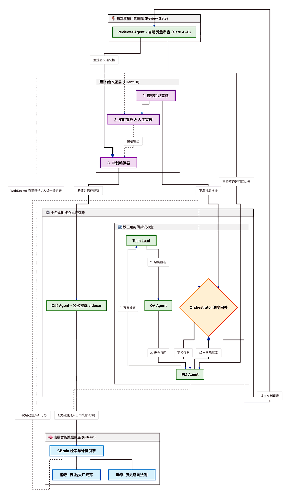
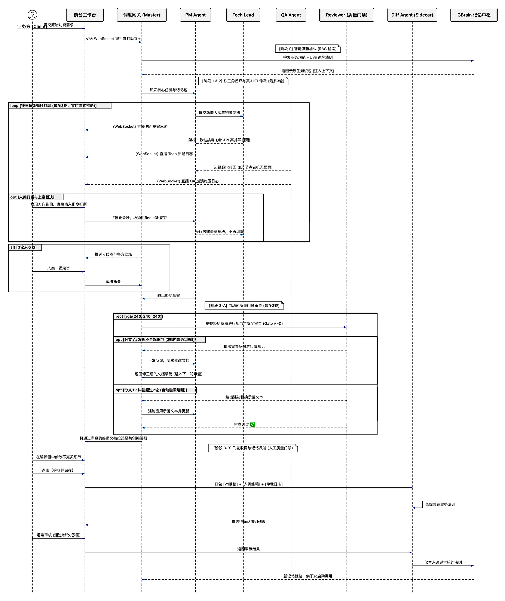

# 全局架构：人机协同全栈飞轮

系统按六个架构边界拆分：前台共创客户端、GBrain 知识库、中台铁三角、Workflow/Tool 层、Diff 经验提炼流程、可信法则入库闭环。本文只描述它们之间的关系，细节进入各子文档。

- [前台架构](01-frontend-architecture.md)
- [知识库架构](02-knowledge-base-architecture.md)
- [中台铁三角架构](03-triangle-agent-architecture.md)
- [Diff 流程架构](04-diff-workflow-architecture.md)
- [工作流与 Tool 架构](05-workflow-tool-architecture.md)

---

## 1. 架构目标

1. **前台可参与**：用户可以实时查看 AI 讨论、打断错误方向、裁决争议、审核候选法则。
2. **知识可复用**：GBrain 只负责可信知识的存储、检索和快照，不承担流程编排。
3. **推理可收敛**：中台铁三角通过 PM、Tech、QA 的攻防形成方案，并在死锁时请求人类仲裁。
4. **经验可治理**：Diff 流程从终稿中提炼候选法则，但必须经过人工审核后才能写入 GBrain。

## 2. 总体分层

| 边界 | 文档 | 核心职责 | 不负责 |
|---|---|---|---|
| 前台共创客户端 | [前台架构](01-frontend-architecture.md) | 任务入口、直播、打断、仲裁、终稿编辑、法则审核 | 模型推理、知识库直写 |
| GBrain 知识库 | [知识库架构](02-knowledge-base-architecture.md) | 知识导入、索引、检索、可信法则存储、快照 | Diff 提炼流程、铁三角编排 |
| 中台铁三角 | [中台铁三角架构](03-triangle-agent-architecture.md) | PM/Tech/QA 攻防、多角色历史上下文绑定、Writer 整合与动态产物渲染、Reviewer 门禁、人类仲裁衔接 | 长期知识沉淀、候选法则治理 |
| Diff 流程 | [Diff 流程架构](04-diff-workflow-architecture.md) | 终稿证据冻结、候选法则提炼、审核流转 | 知识检索服务、方案生成 |
| Workflow/Tool 层 | [工作流与 Tool 架构](05-workflow-tool-architecture.md) | 任务步骤编排、暂停恢复、受控工具调用、权限审计、Tool 事件 | Prompt 内容、前端展示、长期知识治理 |



## 3. 主流程

```text
用户发起任务
  -> 前台提交任务目标和材料
  -> 中台铁三角创建任务沙盒
  -> Workflow Engine 按 TaskDefinition 推进步骤
  -> 中台从 GBrain 检索事实和历史法则
  -> Tool Service 受控执行材料、知识、产物和 Diff 能力
  -> PM / Tech / QA 多轮攻防（期间应用“轮次历史上下文绑定”保证 Agent 完整上下文认知）
  -> 死锁时前台请求用户仲裁
  -> Reviewer 执行质量门禁
  -> Writer Agent 整合三方方案与用户决策，输出文档草案
  -> 自动执行“动态产物渲染决策”（AI 输出优先，测试 Fallback 回退静态模板）
  -> 前台共创编辑器展示草案（支持单 Icon 双态控制按钮与正文点击快捷编辑）
  -> 用户编辑并保存终稿
  -> Diff 流程冻结证据并提炼候选法则
  -> 前台审核候选法则（支持修改后入库与限定作用域）
  -> 审核通过的可信法则写入 GBrain
```



## 4. 边界原则

1. **GBrain 不跑流程**：GBrain 只做知识基础设施，不承载 Diff 编排和铁三角协作。
2. **Diff 不写知识库**：Diff 只输出候选法则，写入 GBrain 必须经过审核。
3. **铁三角不存长期记忆**：任务经验通过 Diff 流程治理后沉淀，不留在 Agent 隐式上下文中。
4. **前台不越权**：前台负责交互和审核，不直接调用模型或写入 GBrain。
5. **Agent 不直接越权使用能力**：材料读取、知识检索、产物写入和 Diff 提炼都必须通过 ToolPolicy 授权的 Tool。

## 5. 路线图

### Phase 1：知识底座

- 建立 GBrain 服务、SDK/API、知识导入和快照能力。
- 支持按任务目标、业务域和作用域检索知识。

### Phase 2：中台协作

- 建立 PM / Tech / QA 的 3 轮共识环。
- 建立 Reviewer 质量门禁。
- 建立死锁分歧包和前台仲裁入口。

### Phase 3：Diff 飞轮

- 建立终稿证据冻结和 Diff 提炼任务。
- 建立候选法则审核、作用域管理和入库审计。
- 审核通过后写入 GBrain，供后续任务检索复用。
