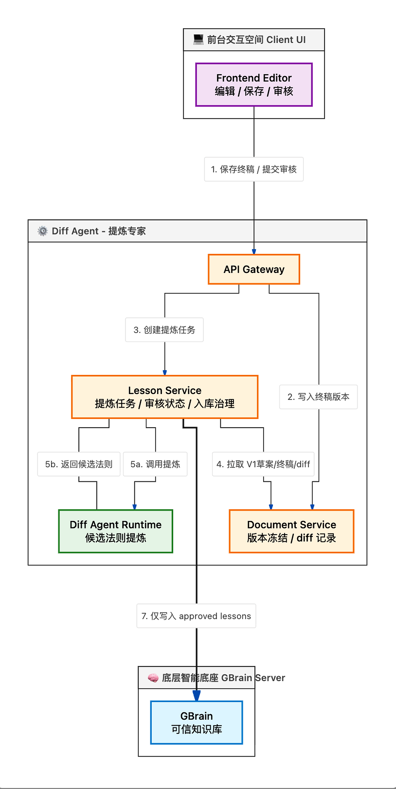
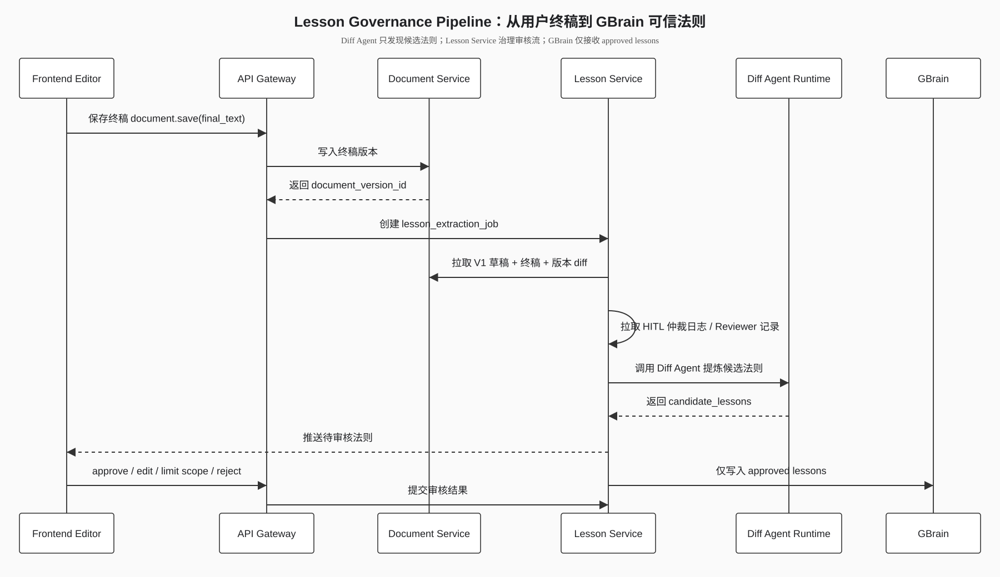

# Diff 流程架构：终稿证据、候选法则与审核入库

Diff 流程是独立的数据飞轮链路，负责从用户终稿中发现可复用经验。它不属于 GBrain 知识库内部，也不属于中台铁三角推理流程。

---

## 1. 定位

Diff 流程在用户保存终稿后启动。它的目标不是修改当前方案，而是把“AI 草稿到用户终稿”的变化提炼为候选法则，并交给用户审核。

## 2. 流程边界

Diff 流程负责：

- 冻结 AI 草稿、用户终稿、版本差异、仲裁记录和 Reviewer 记录。
- 调度 Diff Agent 提炼候选法则。
- 管理候选法则状态。
- 将候选法则推送到前台审核。
- 把审核通过的可信法则写入 GBrain。

Diff 流程不负责：

- PM、Tech、QA 的方案推演。
- GBrain 知识索引和检索。
- 替用户判断候选法则是否可信。
- 修改已保存终稿。

## 3. 证据冻结

用户保存终稿后，系统冻结以下证据：

| 证据 | 用途 |
|---|---|
| AI 草稿 | 作为系统原始输出基线 |
| 用户终稿 | 作为人工修正后的目标版本 |
| 版本差异 | 定位具体修改点 |
| 仲裁记录 | 判断修改是否来自业务裁决 |
| Reviewer 记录 | 判断修改是否来自质量门禁 |

证据冻结的目的是保证候选法则可追溯、可复查、可撤销。

## 4. 提炼流程

```text
终稿保存
  -> 证据冻结
  -> Lesson Service 创建 Diff 任务
  -> Diff Agent 分析差异和上下文
  -> 输出候选法则
  -> 前台展示候选法则
  -> 用户审核并设置作用域
  -> 可信法则写入 GBrain
```





## 5. 候选法则类型

候选法则可以来自：

- 用户补充的业务前置条件。
- 用户修正的平台事实。
- 用户补齐的异常流、降级或补偿策略。
- 用户删除的不适用内容。
- 用户在仲裁中明确的产品原则或技术取舍。

普通润色、一次性措辞偏好和临时口径不应直接成为可复用法则。

## 6. 审核动作

前台对每条候选法则提供四种动作：

1. **通过**：直接批准入库，成为可信法则。
2. **修改后入库**：支持用户直接在前台弹出的模态框中，修改并编辑候选法则的标题和描述内容，确认无误后批准入库。
3. **限定作用域后通过**：限定作用域（全局、业务域、模块或特定场景）后批准入库。
4. **驳回**：拒绝该法则，不写入 GBrain。

## 7. 入库规则

只有审核通过的法则才能写入 GBrain。写入时必须携带：

- 法则内容。
- 来源证据摘要。
- 作用域。
- 审核人和审核时间。
- 版本号和撤销入口。

Diff Agent 的输出永远只是候选，不具备直接生效权。
