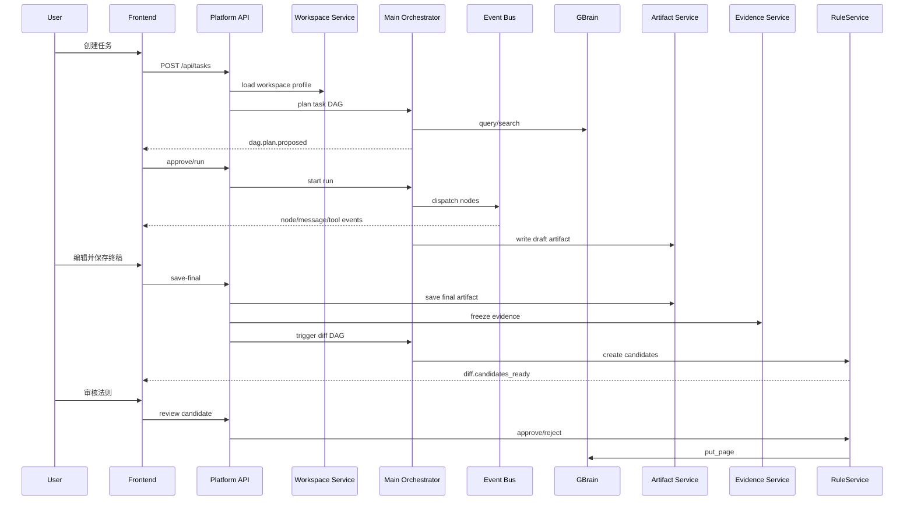

# 00 Evoloop 2.0 全局架构设计

> 状态说明：本文档保留为 2.0 全局架构参考，不再是当前目标架构真相源。
> 当前应优先阅读 `docs/evoloop-3.0/architecture/00-global-architecture.md`。
> 若本文与 3.0 文档冲突，以 3.0 文档为准。

## 1. 设计目标

Evoloop 2.0 的目标不是把 `manual` 和 `prd` 做成两条平行产品线，而是建设一个统一的平台底座，使不同任务类型都能共享：

- Workspace 隔离与领域包装载。
- 主控 Agent 与 Subagent 协作运行时。
- 统一的 DAG 编排与暂停恢复机制。
- GBrain 知识注入与可信法则复用。
- Artifact 版本化、终稿冻结与 Diff 学习闭环。
- 前端共创、仲裁、接管、规则审核与审计回放。

平台需要同时满足三类诉求：

1. 对用户可解释：用户知道系统正在做什么、为什么暂停、为什么请求裁决。
2. 对工程可控：执行过程结构化、可回放、可测试、可恢复。
3. 对产品可积累：终稿中的经验能沉淀为可治理的长期法则。

## 2. 全局分层

```text
Presentation Layer
  Workspace 初始化向导
  任务大厅 / 工作台 / 编辑器 / 规则审核页
  DAG 透视窗 / SSE 直播 / Takeover 面板

Platform Facade Layer
  FastAPI Platform API
  WorkspaceService
  TaskService
  ArtifactService
  EvidenceService
  RuleService
  MaterialService

Agent Runtime Layer
  Main Orchestrator
  Agent Registry + SlotContract
  DAG Planner + DAGValidator
  Event Bus + Session Budget
  Context Slicer + Merge Engine
  Tool Service + ToolPolicy
  Subagents

State Layer
  TaskContext
  BlackboardState
  Checkpoint
  DAGRunState
  CandidateRuleState
  FrozenEvidence

Knowledge & Storage Layer
  GBrain MCP
  task.json / context.json / events.jsonl
  artifacts/
  evidence/
  rules/candidates/
  workspace config
```

## 3. 六条主链路

### 3.1 Workspace 启动链路

```text
创建 Workspace
  -> 选择领域包
  -> 装载扩展包
  -> 绑定 GBrain source
  -> 生成 runtime profile
```

### 3.2 主任务执行链路

```text
创建任务
  -> 生成 DAG 计划
  -> 用户确认或自动确认
  -> Subagent 执行
  -> Blackboard 汇聚
  -> Reviewer / Arbitration
  -> Writer 输出草稿
  -> Artifact 持久化
```

### 3.3 用户共创链路

```text
SSE 旁听
  -> interrupt
  -> takeover
  -> 修改终稿
  -> 提交裁决
  -> 继续执行
```

### 3.4 知识注入链路

```text
根据任务与领域推导 query
  -> GBrain query/search
  -> Blackboard.active_rules / knowledge_context
  -> Context Slice 注入对应节点
```

### 3.5 经验学习链路

```text
用户保存终稿
  -> 冻结证据
  -> Diff DAG
  -> CandidateRule
  -> 人工审核
  -> 写入 GBrain
  -> 后续任务复用
```

### 3.6 治理审计链路

```text
ToolCall 审计
  -> DAG / arbitration / takeover 事件
  -> Artifact / evidence / rule 审计
  -> 回放 / 调试 / 运维分析
```

## 4. 核心边界

| 边界 | 负责 | 不负责 |
|---|---|---|
| Presentation | 展示、输入、用户交互、状态感知 | 执行业务逻辑、解析日志 |
| Platform Facade | 聚合 API、持久化生命周期、调度服务 | LLM 业务推理 |
| Agent Runtime | 计划、执行、合并、仲裁、受控调用 Tool | 长期知识存储 |
| State Layer | 表达任务和执行状态 | 决定领域逻辑 |
| GBrain | 长期知识检索、存储、冲突检测 | 任务编排与规则审核流程 |
| Diff Learning | 从终稿学习候选法则 | 修改当前任务终稿 |

## 5. 统一对象模型

```text
Workspace
  -> many Tasks

Task
  -> many DAG Runs
  -> many Artifacts
  -> many Events
  -> many Evidence snapshots
  -> many Candidate Rules

DAG Run
  -> many Nodes
  -> many Subagent messages
  -> one Blackboard snapshot lineage

FrozenEvidence
  -> many DiffHunks
  -> many CandidateRules

CandidateRule
  -> may become Approved Rule in GBrain
```

## 6. 产品线表达方式

在 Evoloop 2.0 中，产品线不再绑定一套独立 orchestrator，而表达为：

```text
Product Line
  = Task Template
  + Output Spec
  + Domain Pack / Expansion Pack requirements
  + Review Gates
  + Diff extraction policy
```

这意味着：

- `manual` 和 `prd` 是同一平台上的不同模板。
- 新产品线优先通过新增模板和领域包落地，而不是复制运行时。
- 审核、事件、终稿、Diff、规则审核等能力天然复用。

## 7. 数据真相来源

不同数据由不同层做真相源：

| 数据 | 真相源 |
|---|---|
| 任务状态 | `TaskService` + `task.json` |
| 执行共识 | `BlackboardState` + checkpoint |
| 文档正文 | Artifact storage |
| 终稿学习证据 | FrozenEvidence |
| 候选法则状态 | RuleService |
| 长期可信法则 | GBrain |
| 前端展示状态 | 事件回放与 API 查询，不是本地 UI cache |

## 8. 全局时序



## 9. 演进原则

1. 先保证主任务与 Diff 学习解耦，再增强 Diff 精度。
2. 先建立结构化状态和事件，再增强 LLM 智能度。
3. 先用模板化 DAG 承接 `manual`、`prd`，再引入更动态的拓扑生成。
4. 先把 GBrain 当作明确的外部知识基础设施，再做更细的注入策略。
5. 任何能力新增都要先回答：属于平台、运行时、状态层、还是知识层。
