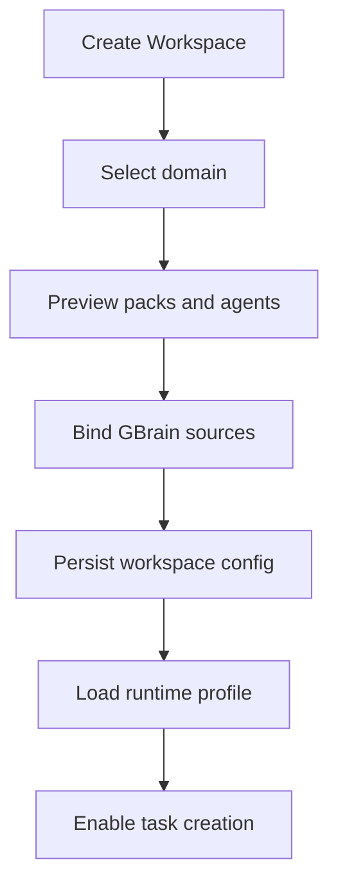

# 01 Workspace 与领域架构

## 1. 为什么 Workspace 是一级架构对象

Evoloop 2.0 面向的不是单次会话，而是可持续运行的团队协作空间。不同团队、产品线和行业场景需要：

- 不同的专业 Agent 组合。
- 不同的 GBrain source 选择。
- 不同的规则作用域与治理策略。
- 不同的任务模板默认值。

如果这些配置散落在 Task 上，平台会快速失去一致性。因此 Workspace 必须成为一级架构边界。

## 2. Workspace 模型

```text
Workspace
  workspace_id
  display_name
  owner
  members[]
  active_domain_pack
  enabled_expansion_packs[]
  default_task_templates[]
  gbrain_sources[]
  security_profile
  rule_scope_policy
  created_at
  updated_at
```

Workspace 至少承担四件事：

1. 选择专业语境。
2. 控制能力边界。
3. 绑定知识来源。
4. 继承规则作用域。

## 3. Domain Pack 与 Expansion Pack

### 3.1 Domain Pack

Domain Pack 表达一个 Workspace 的默认业务语境，例如电商、云原生、SaaS 客服。

它提供：

- 默认 Task Templates。
- 默认 GBrain source 集。
- 默认 SlotContract 版本组合。
- 默认 Reviewer gate 集合。
- 默认 Rule scope policy。

### 3.2 Expansion Pack

Expansion Pack 追加特定能力，如：

- SRE / Reliability
- Observability
- Security Audit
- Campaign Ops

它既可以追加 Agent Slot，也可以覆盖基础 Slot 的实现。

## 4. 装载规则

```text
Workspace activated
  -> load Core Pack
  -> load selected Domain Pack
  -> load enabled Expansion Packs
  -> validate SlotContract compatibility
  -> merge ToolPolicy overlays
  -> derive GBrain source map
  -> create RuntimeProfile
```

### 4.1 RuntimeProfile

`RuntimeProfile` 是 Workspace 当前运行配置的汇总对象：

```text
RuntimeProfile
  active_slots[]
  slot_contract_versions{}
  active_task_templates[]
  tool_policy_overrides
  gbrain_source_map
  reviewer_gate_set
```

Task 创建时不再重新“猜测环境”，而是直接继承 RuntimeProfile。

## 5. Override / Append / Fallback

### 5.1 Override

扩展包替换已有 Slot 的实现，但必须通过 Contract 校验：

- 不允许 silently 改变输入输出 schema。
- 新增 required context 必须升级 contract version。
- 老模板若仍绑定旧 contract，必须有兼容路径或拒绝加载。

### 5.2 Append

扩展包新增 Agent Slot，例如 `Reliability_Guard`。新增节点是否进入执行，由模板或 DAG Planner 决定。

### 5.3 Fallback

若 Domain Pack 加载失败，系统仍可回退到 Core Pack 最小能力集，保证平台可用但以“降级模式”运行。

## 6. Workspace 初始化流程



前端应该显式展示：

- 选中的领域包。
- 将启用的 Agent。
- 将读取的知识源。
- 默认规则作用域。

这样用户知道自己启动的是哪种“专业协作环境”。

## 7. Workspace 与任务的继承关系

```text
Workspace
  -> default domain pack
  -> default tools
  -> default rules
  -> default review gates

Task
  -> may override template-level fields
  -> may request additional packs if permitted
  -> may not bypass workspace security profile
```

Task 可以请求更细的任务参数，但不应绕过 Workspace 的安全和知识边界。

## 8. 多租户与隔离

Workspace 是逻辑租户隔离单元，因此以下对象都必须带 `workspace_id`：

- Task
- Artifact
- Material
- FrozenEvidence
- CandidateRule
- Rule review records
- GBrain source binding cache

不同 Workspace 之间不能共享：

- 未审核的候选法则。
- 未授权的材料和 artifact。
- 运行时黑板快照。

## 9. 领域包与规则作用域的关系

规则作用域并非只有全局与局部两档。建议使用：

```text
global
domain
workspace
module
scenario
```

Workspace 决定默认允许哪些 scope：

- 强监管团队可能允许 `workspace/module/scenario`，禁止直接写 `global`。
- 平台团队可能有权限审核并写入 `rules-global`。

## 10. 失败与降级

### 10.1 Pack 加载失败

- 若是可选 Expansion Pack：跳过并标记降级。
- 若是 Domain Pack：阻止进入对应 Workspace 运行态，提示管理员修复。

### 10.2 Contract 不兼容

- Registry 拒绝启动不兼容 Agent。
- 若导致模板无法满足必需 Slot，任务创建阶段直接失败，不进入运行。

### 10.3 GBrain source 缺失

- 保留 Workspace，但标记 `knowledge_degraded=true`。
- 允许任务执行，但 Reviewer 必须增加“知识降级风险”门禁。

## 11. 对实现层的约束

Workspace 相关逻辑应该集中在平台服务层，不散落到每个 Task handler：

- `WorkspaceService` 负责 profile 生成与缓存。
- `TaskService` 只消费 RuntimeProfile。
- `Main Orchestrator` 不直接决定“加载哪些领域包”，它只读取当前 profile。

这能避免运行时内核和平台配置层互相耦合。
