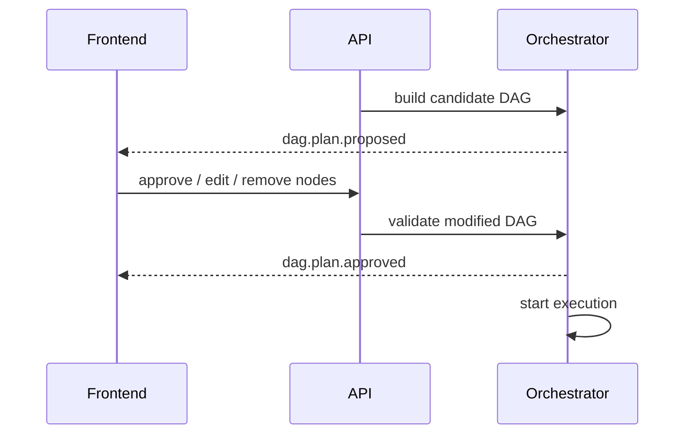

# 03 DAG 编排架构

## 1. 从固定流程到 DAG

Phase 1 的 `WorkflowStep[]` 固定流水线适合最小可运行版本，但 Evoloop 2.0 要支持：

- 不同领域包的不同 Agent 组合。
- 同一任务中并行节点。
- 用户中途接管导致的脏节点重算。
- 主任务后触发的独立 Diff DAG。

因此编排层需要从“线性 steps”演进为“可验证的 DAG”。

## 2. TaskDAG 模型

```text
TaskDAG
  dag_id
  task_id
  template_name
  version
  nodes[]
  edges[]
  auto_approve
  trigger_type: PRIMARY | POST_TASK

DAGNode
  node_id
  agent_slot
  intent
  title
  task_objective
  context_slice_keys[]
  output_schema
  allowed_tools[]
  retry_policy
  timeout_seconds
```

## 3. DAG 来源

### 3.1 Template DAG

由开发者维护 YAML 模板，适合：

- `manual`
- `prd`
- 标准化领域任务

### 3.2 LLM-filled DAG

结构来自模板，LLM 只负责补：

- task objective
- context slice hints
- reviewer emphasis

### 3.3 LLM-generated DAG

用于前所未有的复杂场景，但必须经过严格校验和用户确认。

### 3.4 Post-task DAG

用于终稿后的学习流程，如 `diff_extraction`。它与主 DAG 解耦。

## 4. DAG 计划阶段

```text
Task created
  -> choose template
  -> inject runtime profile constraints
  -> fill node objectives
  -> build candidate DAG
  -> DAGValidator.validate
  -> emit dag.plan.proposed
```

计划阶段的产物不是字符串，而是一份结构化 DAG 草案。

## 5. DAGValidator

Validator 至少校验：

1. 图无环。
2. 所有节点可达。
3. 节点引用的 Slot 存在。
4. 所需 context key 可以被满足。
5. 输出 schema 已注册。
6. allowed_tools 不超出 ToolPolicy。
7. 对于 post-task DAG，触发条件合法。

### 5.1 校验失败语义

- 模板 DAG 失败：系统设计错误，直接阻断。
- LLM-generated DAG 失败：可带错误信息重试一次。
- 用户手动修改 DAG 后失败：前端直接提示非法修改原因。

## 6. Plan-then-Execute

### 6.1 为什么必须有 Plan

如果直接执行，用户只会看到“系统开始跑了”，但不知道：

- 为什么启用了哪些 Agent。
- 哪些节点会并行。
- 哪些地方可能请求自己裁决。

因此应先推送 DAG 计划，再执行。

### 6.2 计划确认流程



常规任务可以 `auto_approve=true`，但仍应向前端推送已生成的计划。

## 7. 节点执行状态机

```text
pending
  -> ready
  -> running
  -> succeeded
  -> failed
  -> blocked
  -> cancelled
  -> stale
  -> skipped
```

### 7.1 `stale`

`stale` 是 Evoloop 2.0 的关键状态，表示：

- 该节点曾经成功执行；
- 但由于用户接管或上游结果变化，其输出已不再可信；
- 后续需要重新执行或显式跳过。

## 8. 暂停、打断与恢复

### 8.1 interrupt

用户点击暂停后，系统不应立即粗暴中断模型调用，而是在节点边界安全挂起。

### 8.2 takeover

Takeover 的完整流程：

1. 用户提出要接管某节点或修正某事实。
2. Orchestrator 广播 `SUSPEND`。
3. Blackboard 冻结写入。
4. 用户注入新事实。
5. DirtyPropagation 标记 stale nodes。
6. Orchestrator 以新的 Blackboard 版本恢复执行。

## 9. 主 DAG 与后置 DAG

### 9.1 主 DAG

目标是交付方案文档或其他 Artifact。

### 9.2 后置 DAG

目标是学习、整理、归档、异步补处理。包括：

- Diff Extraction
- Candidate dedup
- Rule archive review

后置 DAG 不应改变主任务的 `completed/final_saved` 语义。

## 10. Reviewer / Arbitration 作为 DAG 节点

Reviewer 和 Arbitration 不是旁路逻辑，而是 DAG 中明确的控制节点。

```text
... -> reviewer_gate -> arbitration_if_needed -> writer_final
```

这样做的好处是：

- 前端可视化更清晰。
- checkpoint 更容易恢复。
- 用户理解系统为什么停下来。

## 11. 与当前实现的迁移关系

当前代码中的 `WorkflowStep` 可以视为 `TaskDAG` 的线性退化形式：

```text
WorkflowStep[]
  -> nodes[] with implicit edges i -> i+1
```

迁移时建议：

1. 先引入 `TaskDAG` 和 `DAGValidator`。
2. 把现有 `prd`、`manual` workflow 自动转换为线性 DAG。
3. 再逐步引入并行、plan approval、stale re-run 和 post-task DAG。
