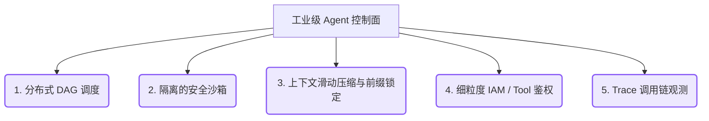

# 03 Evoloop 3.0 模块代码量盘点与工业级演进指南

本指南对 Evoloop 3.0 当前的后端代码体积进行深度剖析，结合“入门工业级 Agent 系统”的技术要求，建立各模块的量化目标（Line of Code, LoC），并规划清晰的演进与改进路径。

---

## 1. 后端各模块代码量现状与工业级目标

在完成 `Gap Closure` 后，目前 Evoloop 后端纯 Python 代码（含测试，不含前端）的总行数已上升至 **7,224** 行。为达到工业级生产系统的标准，各模块的量化对比与功能要求如下：

### 1.1 核心契约层 (`app/core/*`)
*   **当前代码量**：**1,364 行**
*   **目标代码量**：**2,000 - 2,500 行**
*   **核心差距与优化内容**：
    *   **补齐核心占位**：目前 `dag.py` 和 `blackboard.py` 仅为 30-50 行的骨架。工业级需要实现 Blackboard 内存槽（Slot）的动态加载与鉴权。
    *   **图状态强校验**：增强 `ArtifactGraph.validate()`，引入有向无环图的环路检测（Cycle Detection）和依赖断言。
    *   **强类型序列化**：支持将 3.0 本地实体直接序列化并持久化，取代在 API 层的运行时临时 Facade 转换。

### 1.2 工作流引擎层 (`app/workflows/engine.py` 等)
*   **当前代码量**：**735 行** (其中 `engine.py` 占 688 行)
*   **目标代码量**：**2,500 - 3,500 行**
*   **核心差距与优化内容**：
    *   **动态 DAG 调度器**：淘汰现有的线性顺序调度，实现基于前置依赖的 `PlaybookDAGRuntime`，支持多分支并行、条件跳转与动态循环。
    *   **事务级 Checkpoint**：支持分布式事件溯源与状态回放（Replay），能够在任意一步出错时回滚至上一个完备的 Checkpoint。
    *   **职责纯粹化**：剥离引擎中硬编码的 `_render_xxx` 字符串拼接逻辑，引擎仅管“状态流转”，不干预数据表达。

### 1.3 编排与 Playbook 逻辑 (`app/workflows/spec_to_agent.py` 等)
*   **当前代码量**：**541 行** (含遗留的 manual/prd)
*   **目标代码量**：**2,000 - 3,000 行**
*   **核心差距与优化内容**：
    *   **LLM 对抗性校验**：将 `acceptance_review.py` 中的 `verify` 逻辑从正则字符串匹配（匹配 bug/todo）重构为真实的 **LLM 对抗性审查**，运用大模型进行业务漏洞与边界用例的主动推演。
    *   **任务步骤解耦**：将 `spec_to_agent` 中每一个 WorkflowStep 的执行细节移出引擎，沉淀为独立的 Playbook 任务执行器（Task Executor）。

### 1.4 基础服务层 (`app/services/*`)
*   **当前代码量**：**1,500 行**
*   **目标代码量**：**4,500 - 6,000 行**
*   **核心差距与优化内容**：
    *   **安全隔离沙箱**：自研或对接轻量级容器隔离模块（如 Docker SDK / MicroVM / WASM 运行时），确保 AI Worker 提交的代码在安全沙箱中执行，防范系统命令注入。
    *   **上下文滑动窗口优化**：在 `llm.py` 中引入 Sticky Latch（粘性前缀锁定）以提高 Prompt Caching 命中率，并在 Token 即将溢出时触发 LLM 会话的自动脱水（Compaction）与复水（Rehydration）。
    *   **GBrain 服务对齐**：完善 `gbrain_service` 的 Heuristics 沉淀闭环，解决目前测试中偶发的 `Unknown command: add` 命令解析警告。

### 1.5 接口与适配层 (`app/api/*`, `app/cli/*`, `app/mcp/*`)
*   **当前代码量**：**1,348 行**
*   **目标代码量**：**3,000 - 4,000 行**
*   **核心差距与优化内容**：
    *   **多租户与 IAM**：为 FastAPI 接口引入租户级文件和工作区物理隔离。
    *   **MCP 协议深度对齐**：支持标准 MCP 的 Resource 动态订阅（Subscription），开放更丰富的 Context 查询能力。
    *   **CLI 折叠增强**：优化 `app/cli/utils.py`，智能折叠超长终端错误，并在人机交互通道中引入轻量级用户情绪正则拦截。

### 1.6 测试用例库 (`tests/*`)
*   **当前代码量**：**1,736 行**
*   **目标代码量**：**5,000 - 8,000 行**
*   **核心差距与优化内容**：
    *   补充多模型 API 故障切换降级（Fallback）、网络丢包重试、并发读写冲突等非功能性测试用例。
    *   引入 Golden Test Sets（黄金测试集），确保 Agent 大版本升级时核心输出行为无“语义漂移（Behavioral Drift）”。

---

## 2. 距离“工业级”的 5 大工程差距

Evoloop 3.0 要实现生产环境下的高可用，必须攻克以下 5 大非功能性设计难题：

1.  **调度健壮性**：从简单的 while 循环和线程池，向支持有向无环图、超时熔断和状态动态回溯的分布式工作流引擎演进。
2.  **执行安全性**：杜绝 Agent 在宿主机直接读写运行代码，全面采用容器/沙箱化隔离执行。
3.  **Token 降本增效**：利用 Sticky Latch 保证 Prompt Caching 接近 100% 命中，并利用 Compaction 策略降低多轮对话费用。
4.  **资源授权颗粒度**：Tool 鉴权不能局限于单一的 Boolean 准入，必须细化至基于文件目录、租户角色和操作种类的控制。
5.  **可重现性审计**：全面接入 OpenTelemetry 规范，能够对 Agent 的每一次决策和 LLM 参数进行精准的 Span 分布式链路追踪。

---

## 3. 原生演进三步走建议

建议遵循 **KISS（简洁至上）原则**，分阶段分步骤完成代码量与复杂度的填充：

### 3.1 阶段一：攻坚 AI 核心质检效能（短期）
*   **优化内容**：在 `app/workflows/acceptance_review.py` 中，使用真实的大模型审查机制替代正则表达式 Mock 的 `AdversarialVerificationAgent`。
*   **目标**：真正实现多角色博弈与逻辑边界推演，将该模块 LoC 提升至约 500 行，奠定系统核心技术壁垒。

### 3.2 阶段二：引擎解耦与真相源落地（中期）
*   **优化内容**：
    1. 剥离 `engine.py` 中的字符串渲染硬编码，移至独立的 `ContextCompilerService`。
    2. 实现 `ProductContext` 与 `ArtifactGraph` 的物理 JSON/YAML 持久化，彻底干掉 API 层的 Facade 临时拼凑逻辑。
*   **目标**：使引擎和数据契约完全解耦，减少无用运行时对象转换。

### 3.3 阶段三：调度内核与缓存优化（长期）
*   **优化内容**：
    1. 将工作流内核重构为 `PlaybookDAGRuntime`，支持节点分支路由。
    2. 在 `llm.py` 中引入 Sticky Latch（粘性前缀锁）和会话 Compaction。
*   **目标**：项目总行数自然攀升至 **20,000+** 行，整体达到工业级控制台交付水准。
